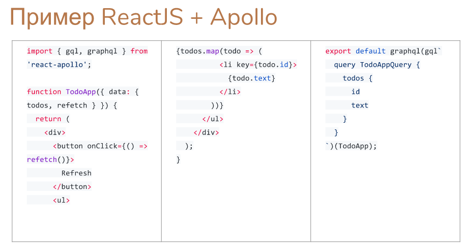

graphql simple sample

yarn run dev:start

localhost:4321/graphql

{
  user(username: "teacher") {
    password
  }
}

В отличие от RESTful мы работаем не с конкретным объектом, а с запросом - это похоже на SQL. Мы можем запросить нужные атрибуты.  Мы не должны делать дополнительных запросов для уточнения информации по объекту. Выполняется проверка типов на извлечении (query) и изменении (mutation). Мы можем запросить рефлексию (уточнить типы и т.п). Может быть параметризация запроса, псевдонимизация (было username, стало login). У нас одна точка входа - работает один сервер, работающий с запросами разного типа. Схема определяется на стороне сервера. 

Не зависит от протокола - может быть HTTP, WebSockets, ...

NodeJS: apollo-server (включая девелоперский graphiql) - в ноябре 2017 версия 2.

PHP: graphql-php (описание схемы в словаре с анонимными функциями)

Псевдонимы, директивы, переменные, фрагменты. 

 - alias:field[(param: ..., ...)]
 - @include(if: ..., @skip(if: ...)
 - $var:Type[!] ! - для обязательного; можно через = значение по умолчанию
 - fragment <name> on Type { структура }, ссылка ...fragment_name
  
Если нужен клиент (для рефлексии например) - то 

PHP: laravel-graphql, graphql-php

JavaScript: grapql-js (Facebook - поддерживает Subscriptions (realtime updates)), Apollo Client (есть связывание с React, Angular)

Apollo (полезно использовать eslint-plugin-graphql для проверки запросов по схеме), intellij-graphql (запросы внутри IDE)

Задание:

создайте реакт-клиент

http://graphql.org/learn/queries/ 

Выступление Павла Черторогова (https://twitter.com/nodkz https://github.com/nodkz) на HolyJS-2017 Moscow

https://holyjs-moscow.ru/talks/491dtd5v6mcsikkukeyk62/

https://www.slideshare.net/nod/graphql-the-holy-contract-between-client-and-server

